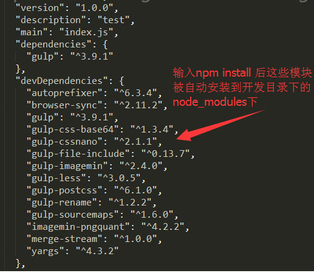

# NPM

NPM的全称是Node Package Manager，是随同NodeJS一起安装的包管理工具，能解决NodeJS代码部署上的很多问题，常见的使用场景有一下几种：

* 允许用户从NPM服务器下载别人编写的第三方包到本地使用。
* 允许用户从NPM服务器下载并安装别人编写的命令行程序到本地使用。
* 允许用户将自己编写的包或命令行程序上传到NPM服务器供别人使用。

由于新版的nodejs已经集成了npm，所以之前npm也一并安装好了。同样可以通过输入 **"npm -v" **来测试是否成功安装。命令如下，出现版本提示表示安装成功:

```sh
$ npm -V
3.10.3
```

如果你安装的是旧版本的 npm，可以很容易得通过 npm 命令来升级，命令如下：

```sh
$ npm install npm -g
C:\Users\Targeral\AppData\Roaming\npm\npm -> C:\Users\Targeral\AppData\Roaming\npm\node_modul
es\npm\bin\npm-cli.js
C:\Users\Targeral\AppData\Roaming\npm
```

## 使用 npm 命令安装模块

npm 安装 Node.js 模块语法格式如下：

```
$ npm install <Module Name>
```

例如安装**express**：

```
$ npm install express
```

安装好之后，express 包就放在了工程目录下的 node_modules 目录中，因此在代码中只需要通过 **require('express')** 的方式就好，无需指定第三方包路径。

```javascript
var express = require('express');
```

*安装包，默认会安装最新的版本* ，安装指定版本的模块有以下几种方法:

1. 安装模块的指定版本：`npm install <name>@<version>` ,例如：`npm install underscore@1.5.2`
2. 安装模块指定版本号范围内的某一个版本：`npm install <name>@<version range>` ,例如：`npm install async@">=0.2.0 <0.2.9"`

3. 安装指定URL的模块：`npm install <tarball url> `,例如：`npm install https://github.com/targeral/xxxx/v0.5.6`
4. 安装本地文件系统中指定的目录包含的模块：`npm install <folder>`
5. 安装模块的config的tag配置中含有指定tag的版本：`npm install <name>@<tag>` ,例如：`npm install sax@latest`

## `npm install` 后的相关的参数

### `npm install <Module> -g`

npm 的包安装分为本地安装（local）、全局安装（global）两种，从敲的命令行来看，差别只是有没有-g而已，比如

```
npm install epxress # 本地安装
npm install express -g # 全局安装
```

如果出现以下错误：

```
npm err! Error: connect ECONNREFUSED 127.0.0.1:8087 
```

解决办法为：

```
$ npm config set proxy null
```

#### 本地安装

- 1. 将安装包放在 ./node_modules 下（运行 npm 命令时所在的目录），如果没有 node_modules 目录，会在当前执行 npm 命令的目录下生成 node_modules 目录。
- 2. 可以通过 require() 来引入本地安装的包。

#### 全局安装

- 1. 将安装包放在 /usr/local 下或者你 node 的安装目录。


- 2. 可以直接在命令行里使用。

### `npm install <Module> -S/ --save`

安装包信息将加入到dependencies（生产阶段的依赖）

```
npm install gulp --save 或 npm install gulp -S
```

package.json 文件的 dependencies 字段：

```json
"dependencies": {
    "gulp": "^3.9.1"
}
```

关于package.json,详见。

### `npm install <Module> -D/ --save-dev`

安装包信息将加入到devDependencies（开发阶段的依赖），所以开发阶段一般使用它。

```
npm install gulp --save-dev 或 npm install gulp -D
```

package.json 文件的 devDependencies字段：

```json
"devDependencies": {
    "gulp": "^3.9.1"
}
```

### `npm install <Module> -O/--save-optional`

安装包信息将加入到optionalDependencies（可选阶段的依赖）

```
npm install gulp --save-optional 或 npm install gulp -O
```

package.json 文件的optionalDependencies字段：

```json
"optionalDependencies": {
    "gulp": "^3.9.1"
}
```

### `npm install <Module> -E/--save-exact`

精确安装指定模块版本

```
npm install gulp --save-exact 或 npm install gulp -E
```

输入命令**npm install gulp -ES，**留意package.json 文件的 dependencies 字段，以看出版本号中的**^**消失了

```json
"dependencies": {
    "gulp": "3.9.1"
}
```

模块的依赖都被写入了package.json文件后，他人打开项目的根目录（项目开源、内部团队合作），使用npm install命令可以根据dependencies配置安装所有的依赖包。




## 使用NPM卸载模块

基础语法

```
npm uninstall [<@scope>/]<pkg>[@<version>]... [-S|--save|-D|--save-dev|-O|--save-optional]

aliases: remove, rm, r, un, unlink
```

如卸载开发版本的模块

```
npm uninstall gulp --save-dev
```

## npm update 更新模块

基础语法

```
npm update [-g] [<pkg>...]
```

## npm outdated 检查模块是否已经过时

基础语法

```
npm outdated [[<@scope>/]<pkg> ...]
```

此命令会列出所有已经过时的包，可以及时进行包的更新。

## npm ls 查看安装的模块

基础语法

```
npm ls [[<@scope>/]<pkg> ...]

aliases: list, la, ll
```

查看全局安装的模块及依赖 

```
npm ls -g 
```

## npm init 在项目中引导创建一个package.json文件

安装包的信息可保持到项目的package.json文件中，以便后续的其它的项目开发或者他人合作使用，也说package.json在项目中是必不可少的。

```
npm init [-f|--force|-y|--yes]
```

## npm help 查看某条命令的详细帮助 

基础语法

```
npm help <term> [<terms..>]
```

例如输入`npm help install`，系统在默认的浏览器或者默认的编辑器中打开本地nodejs安装包的文件`/nodejs/node_modules/npm/html/doc/cli/npm-install.html`

```
npm help install
```

## **npm root **查看包的安装路径

输出 node_modules的路径

```
npm root [-g]
```

## **npm config **管理npm的配置路径

基础语法

```
npm config set <key> <value> [-g|--global]
npm config get <key>
npm config delete <key>
npm config list
npm config edit
npm get <key>
npm set <key> <value> [-g|--global]
```

对于config这块用得最多应该是**设置代理，解决npm安装一些模块失败的问题**。

例如在公司， 因为防火墙的原因，无法完成任何模块的安装，这个时候设置代理可以解决

```
npm config set proxy=http://dev-proxy.oa.com:8080
```

又如国内的网络环境问题，某官方的IP可能被和谐了，幸好国内有好心人，搭建了镜像，此时我们简单设置镜像

```
npm config set registry="http://r.cnpmjs.org"
```

也可以临时配置，如安装淘宝镜像

```
npm install -g cnpm --registry=https://registry.npm.taobao.org
```

## npm cache 管理模块的缓存

基础语法

```
npm cache add <tarball file>
npm cache add <folder>
npm cache add <tarball url>
npm cache add <name>@<version>

npm cache ls [<path>]

npm cache clean [<path>]
```

最常用命令无非清除npm本地缓存

```
npm cache clean
```

## npm start 启动模块

基础语法

```
npm start [-- <args>]
```

该命令写在package.json文件scripts的start字段中，可以自定义命令来配置一个服务器环境和安装一系列的必要程序，如

```
"scripts": {
    "start": "gulp -ws"
}
```

此时在cmd中输入npm start命令相当于执行gulpfile.js文件自定义的watch和server命令。

如果package.json文件没有设置start，则将直接启动node server.js

## npm stop 停止模块

基础语法

```
npm stop [-- <args>]
```

## npm restart 重新启动模块

基础语法

```
npm restart [-- <args>]
```

## npm test 测试模块

基础语法

```
npm test [-- <args>]
npm tst [-- <args>]
```

该命令写在package.json文件scripts的test字段中，可以自定义该命令来执行一些操作，如

```
"scripts": {
    "test": "gulp release"
},
```

此时在cmd中输入npm test命令相当于执行gulpfile.js文件自定义的release命令。

## npm version 查看模块版本

基础语法

```
npm version [<newversion> | major | minor | patch | premajor | preminor | prepatch | prerelease | from-git]

'npm [-v | --version]' to print npm version
'npm view <pkg> version' to view a package's published version
'npm ls' to inspect current package/dependency versions
```

查看模块的版本

```
npm version
```

## npm view 查看模块的注册信息

基础语法

```
npm view [<@scope>/]<name>[@<version>] [<field>[.<subfield>]...]

aliases: info, show, v
```

查看模块的依赖关系

```
npm view gulp dependencies
```

查看模块的源文件地址

```
npm view gulp repository.url
```

查看模块的贡献者，包含邮箱地址

```
npm view npm contributors
```

## npm publish 发布模块

基础语法

```
npm publish [<tarball>|<folder>] [--tag <tag>] [--access <public|restricted>]

Publishes '.' if no argument supplied
Sets tag 'latest' if no --tag specified
```

## npm access 在发布的包上设置访问级别

基础语法

```
npm access public [<package>]
npm access restricted [<package>]

npm access grant <read-only|read-write> <scope:team> [<package>]
npm access revoke <scope:team> [<package>]

npm access ls-packages [<user>|<scope>|<scope:team>]
npm access ls-collaborators [<package> [<user>]]
npm access edit [<package>]
```

## npm package.json的语法

**默认值**

npm会根据包内容设置一些默认值。

- `"scripts": {"start": "node server.js"}`

  如果包的根目录有`server.js`文件，npm会默认将`start`命令设置为`node server.js`。

- `"scripts":{"preinstall": "node-waf clean || true; node-waf configure build"}`

  如果包的根目录有`wscript`文件，npm会默认将`preinstall`命令用node-waf进行编译。

- `"scripts":{"preinstall": "node-gyp rebuild"}`

  如果包的根目录有`binding.gyp`文件，npm会默认将`preinstall`命令用node-gyp进行编译。

- `"contributors": [...]`

  如果包的根目录有`AUTHORS`文件，npm会默认逐行按`Name  (url)`格式处理，邮箱和url是可选的。#号和空格开头的行会被忽略。

**name**

在package.json中最重要的就是name和version字段。他们都是必须的，如果没有就无法install。name和version一起组成的标识在假设中是唯一的。改变包应该同时改变version。

name是这个东西的名字。注意：

- 不要把node或者js放在名字中。因为你写了package.json它就被假定成为了js，不过你可以用"engine"字段指定一个引擎（见后文）。
- 这个名字会作为在URL的一部分、命令行的参数或者文件夹的名字。任何non-url-safe的字符都是不能用的。
- 这个名字可能会作为参数被传入require()，所以它应该比较短，但也要意义清晰。
- 在你爱上你的名字之前，你可能要去npm registry查看一下这个名字是否已经被使用了。[http://registry.npmjs.org/](http://registry.npmjs.org/)

**version**

version必须能被[node-semver](https://github.com/isaacs/node-semver)解析，它被包在npm的依赖中。（要自己用可以执行`npm install semver`）

可用的“数字”或者“范围”见[semver(7)](https://npmjs.org/doc/misc/semver.html).

**description**

放简介，字符串，方便在`npm search`中搜索

**keywords**

关键字，数组、字符串，方便在`npm search`中搜索

**bugs**

你项目的提交问题的url和（或）邮件地址

```
{
 "url" : "http://github.com/owner/project/issues", 
"email" : "project@hostname.com"
}
```

**license**

你应该要指定一个许可证，让人知道使用的权利和限制的。

最简单的方法是，假如你用一个像BSD或者MIT这样通用的许可证，就只需要指定一个许可证的名字，像这样：

```
{ "license" : "BSD" }
```

如果你有更复杂的许可条件，或者想要提供给更多地细节，可以这样:

```
"licenses" : [
  { "type" : "MyLicense"
  , "url" : "http://github.com/owner/project/path/to/license"
  }
]
```

**repository**

指定你的代码存放的地方。这个对希望贡献的人有帮助。如果git仓库在github上，那么`npm docs`命令能找到你。

这样做：

```
"repository" :
  { "type" : "git"
  , "url" : "http://github.com/isaacs/npm.git"
  }

"repository" :
  { "type" : "svn"
  , "url" : "http://v8.googlecode.com/svn/trunk/"
  }
```

URL应该是公开的（即便是只读的）能直接被未经过修改的版本控制程序处理的url。不应该是一个html的项目页面。因为它是给计算机看的。

**scripts**

“scripts”是一个由脚本命令组成的hash对象，他们在包不同的生命周期中被执行。key是生命周期事件，value是要运行的命令。

参考上面的[npm start](http://www.cnblogs.com/PeunZhang/p/5553574.html#npm-start)、[npm test](http://www.cnblogs.com/PeunZhang/p/5553574.html#npm-test)命令

更多详细请看 [npm-scripts(7)](https://npmjs.org/doc/misc/npm-scripts.html)

**config**

"config" hash可以用来配置用于包脚本中的跨版本参数。在实例中，如果一个包有下面的配置：

```
{
 "name" : "foo",
 "config" : { "port" : "8080" } 
}
```

然后有一个“start”命令引用了`npm_package_config_port`环境变量，用户可以通过`npm config set foo:port 8001`来重写他。

参见 [npm-config(7)](https://npmjs.org/doc/misc/npm-config.html) 和 [npm-scripts(7)](https://npmjs.org/doc/misc/npm-scripts.html)。

**dependencies**

依赖是给一组包名指定版本范围的一个hash。这个版本范围是一个由一个或多个空格分隔的字符串。依赖还可以用tarball或者git URL。

请不要将测试或过渡性的依赖放在`dependencies`hash中。见下文的`devDependencies`

**详见semver(7).**

- `version` 必须完全和`version`一致
- `>version` 必须比`version`大
- `>=version` 同上
- `<version` 同上
- `<=version` 同上
- `~version` 大约一样，见[semver(7)](https://npmjs.org/doc/misc/semver.html)
- `1.2.x` 1.2.0, 1.2.1, 等，但不包括1.3.0
- `http://...` 见下文'依赖URL'
- `*` 所有
- `""` 空，同`*`
- `version1 - version2` 同 `>=version1 <=version2`.
- `range1 || range2` 二选一。
- `git...` 见下文'依赖Git URL'
- `user/repo` 见下文'GitHub URLs'

比如下面都是合法的：

```
{ "dependencies" :
  { "foo" : "1.0.0 - 2.9999.9999"
  , "bar" : ">=1.0.2 <2.1.2"
  , "baz" : ">1.0.2 <=2.3.4"
  , "boo" : "2.0.1"
  , "qux" : "<1.0.0 || >=2.3.1 <2.4.5 || >=2.5.2 <3.0.0"
  , "asd" : "http://asdf.com/asdf.tar.gz"
  , "til" : "~1.2"
  , "elf" : "~1.2.3"
  , "two" : "2.x"
  , "thr" : "3.3.x"
  }
}
```

**devDependencies**

如果有人要使用你的模块，那么他们可能不需要你开发使用的外部测试或者文档框架。

在这种情况下，最好将这些附属的项目列在`devDependencies`中。

这些东西会在执行`npm link`或者`npm install`的时候初始化，并可以像其他npm配置参数一样管理。详见[npm-config(7)](https://npmjs.org/doc/misc/npm-config.html)。

对于非特定平台的构建步骤，比如需要编译CoffeeScript，可以用`prepublish`脚本去实现，并把它依赖的包放在devDependency中。（译者注：prepublish定义了在执行`npm publish`的时候先行执行的脚本）

比如：

```
{ "name": "ethopia-waza",
  "description": "a delightfully fruity coffee varietal",
  "version": "1.2.3",
  "devDependencies": {
    "coffee-script": "~1.6.3"
  },
  "scripts": {
    "prepublish": "coffee -o lib/ -c src/waza.coffee"
  },
  "main": "lib/waza.js"
}
```

`prepublish`脚本会在publishing前运行，这样用户就不用自己去require来编译就能使用。并且在开发模式中（比如本地运行`npm install`）会运行这个脚本以便更好地测试。


## 参考资料

http://www.cnblogs.com/PeunZhang/p/5553574.html#npm-install

[package.json参考资料](https://github.com/ericdum/mujiang.info/issues/6/)

http://realwall.cn/blog/?p=120

http://www.runoob.com/nodejs/nodejs-npm.html

https://docs.npmjs.com/#cli