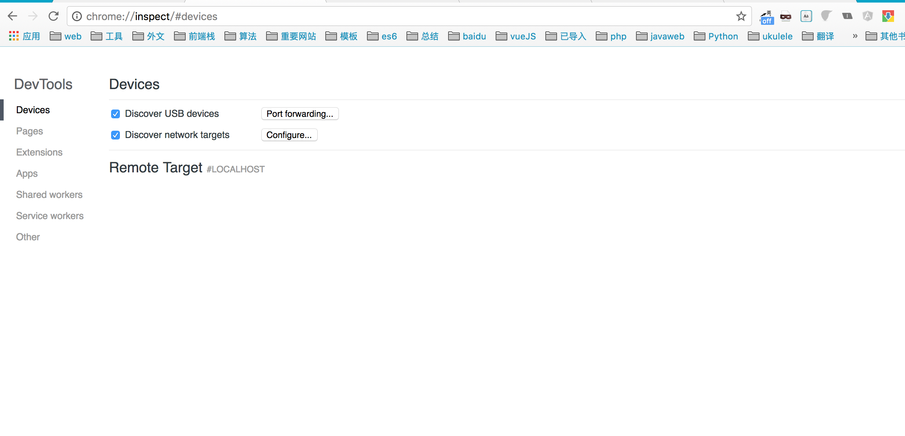
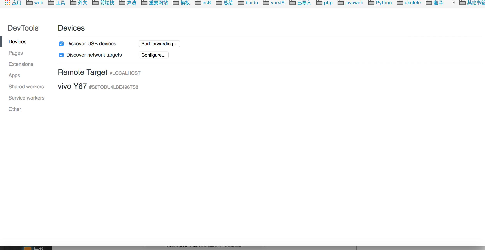
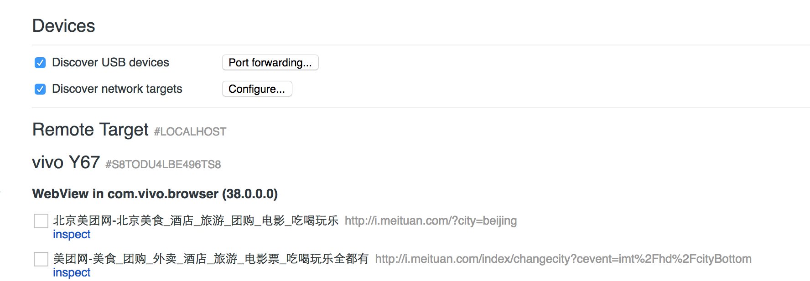
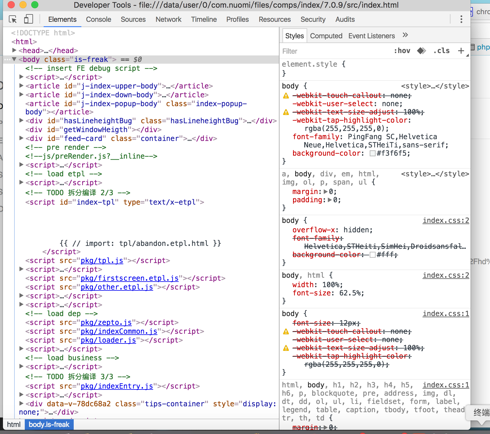
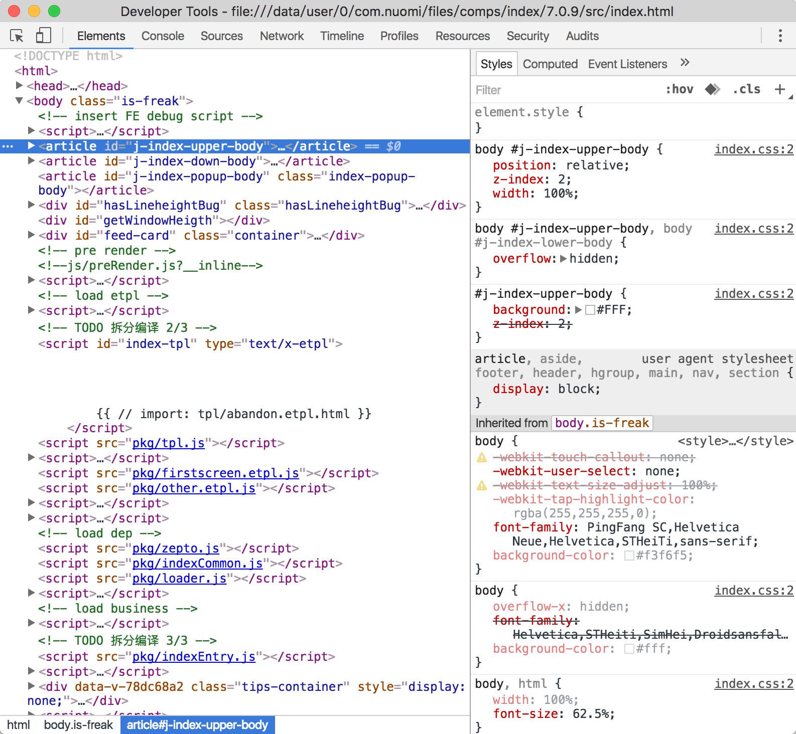
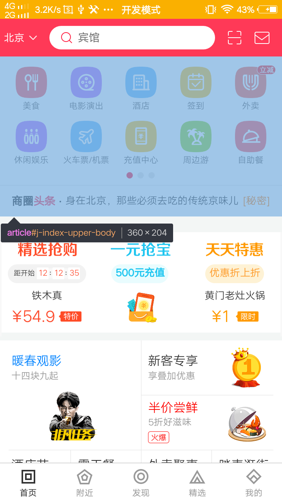

# 2017.03.31 Summary
## minimist
[资料链接](http://www.jianshu.com/p/231b931ab389)
[github](https://github.com/substack/minimist)

## 元素吸顶解决方案
用于解决PC端，手机端(Android && IOS) 吸顶解决方案

[资料链接](http://www.ayqy.net/blog/%E5%90%B8%E9%A1%B6%E6%95%88%E6%9E%9C%E8%A7%A3%E5%86%B3%E6%96%B9%E6%A1%88/)

## chrome调试指南

[资料链接](http://www.jianshu.com/p/cf36d48652f4)
[官方](https://developer.chrome.com/devtools)

## chrome手机开发调试
刚入职，最近学习了很长时间，终于接到了自己的第一个需求。经过了解，我们的开发模式就是传说中的 **hybrid**（我之前听说过，但是没接触过，老司机的请路过，嘿嘿）。

简单的说一下关于hybrid app。Hybrid App，又叫做混合模式移动应用，是指介于web-app,native-app这两者之间的app，兼具“Native App良好交互体验的优势”和
“Web App跨平台开发的优势”。

根据我所在的部门在做的app的了解和导师平时的解释，我们是在一个webview里进行前端的开发，外层有一个NA提供一些端上的能力。webview就是类似浏览器，所以我们可以在里面就像平时在pc端开发一样开发前端，所以我们部门是c端(client 也就是客户端)的前端开发。

简单的说了一下关于hybrid以及自己的情况，接下来说正题，如何进行手机端开发调试。

首先，打开chrome，在输入框中输入：[chrome://inspect/#devices](chrome://inspect/#devices)，进入手机远程调试界面(RemoteDebugging)。

然后，要将你的手机调成开发者模式，并打开USB调试。

这个时候，当你打开一个webapp的时候，会出现一条记录，上面有网址和title，重点是有一个可点击的`inspect`。之后我
们要点击`inspect`。

点击之后，会出现我们很熟悉的调试界面，如下：

这个时候当我们选中其中的一个dom的时候，就会发生神奇的事情：

这样我们就可以看着手机在电脑上开发调试了。