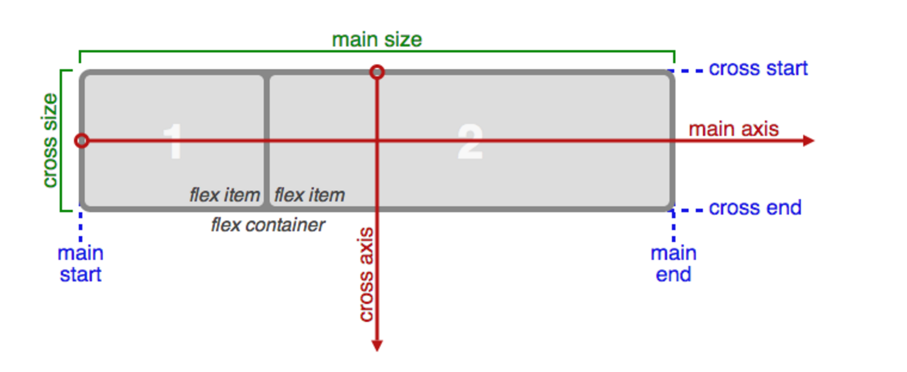
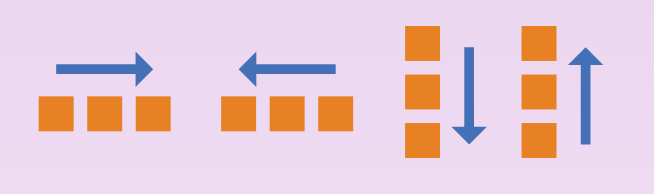

# FlexBox

## 背景介绍

关于`FlexBox`具体的背景介绍，有很多好的网站有写到，比如：[css-tricks](https://css-tricks.com/snippets/css/a-guide-to-flexbox/)上的background，如果你感觉读英文麻烦的话；或者可以看一下阮一峰的[Flex布局教程：语法篇](http://www.ruanyifeng.com/blog/2015/07/flex-grammar.html?utm_source=tuicool)的开头部分。这里讲一下我对于`FlexBox`的理解：

`flexbox`布局是一种从父元素（又叫做容器）上进行大局的控制子元素的布局基本布局，比如子元素在行向如何排列、在纵向如何的排列与展示、元素是否要换行等等。这是一个大局上或者整体上的控制。然后他们的子元素（又叫做项目）又可以自己进行微调来重置在容器上的统一控制、控制项目的排列顺序以及对于未知空间如何进行分配。所以说`flexbox`是一种 *对于一些布局规则很统一的一所有（或者大部分）元素* ，是一种很灵活、易于控制、对于未知空间可预测和控制的布局。

## 基本概念

`flexbox`的布局概念分为两部分：容器上的整体控制，项目上的微调控制。在学习这两个部分之前，需要先了解一些概念和术语。

### 一些概念和术语

#### 容器与项目

容器指的是父元素，项目指的是子元素。


#### 主轴与次轴

在`flexbox`里，我们需要规定一个方向(横向或者纵向)为我们的主轴(Main)，另一个方向为次轴(cross)。 *其实主轴次轴到底是什么概念我们不care，只是为了两个方向定的名词以便区分和控制*

#### 主轴，次轴的开始端和结束端

主轴，次轴的开始端与结束端比较重要的一点就是：主轴的开始端与结束端决定了主轴的方向。这个有助于理解后续讲到的`flex-direction`概念。如果不太理解，可以看下下面的图。

#### 主轴的长度和次轴的长度

这个其实也没什么好说的就是类似`width`和`height`。看下图。



### 容器上的整体控制

#### display

`flexbox`布局的`display`有两个属性值：`flex` 和 `inline-flex`。用于定义(声明)一个flex容器，`inline`或是`block`取决于所给定的值。它为容器的（直接）子元素创建了一个flex环境。

#### flex-direction
`flex-direction`属性决定了主轴的方向或者说所有项目从哪端开始放置，这里的方向是指两方面：

* 横向或纵向
* 横向前提下，从左到右或从右到左；纵向前提下，从上到下或从下到上。

所以它有四个属性值：

* `row`(default)：从左到右
* `row-reverse`: 从右到左
* `column`: 从上到下
* `column-reverse`: 从下到上

注意点：

1. 当属性值为`row`或者`row-reverse`的时候，次轴的方向默认为从上到下。
2. 当属性值为`column`或者`column-reverse`的时候，次轴的方向默认为从左到右。



#### flex-wrap

`flex-wrap`属性决定了如果项目们如果超出一行的距离要不要换行。它的属性值有三个：


* `nowrap`(default): 所有项目都在一行。即使所有的项目的实际长度超出容器的长度，这个时候每个项目的长度会自动减少。也就是说设置的`width`或`height`无效了，其大小为 `容器长度 / 项目的个数`。
* `wrap`: 所有的项目都按照正常的方式排列————当遇到该换行的地方，正常换行。换到下一行的时候 *从主轴的开始端开始, 从次轴的开始端开始* 。
* `wrap-reverse`: 所有的项目都按照正常的方式排列————当遇到该换行的地方，正常换行。换到下一行的时候 *从主轴的开始端开始, 从次轴的结束端开始*

**注释：如果看见有些懵，不要太担心，接着看下一节，我想会更好的理解**

#### flex-flow

`flex-flow`属性是`flex-direction`和`flex-wrap`的简写形式，默认值为`row nowrap`。写法如下:

```css
.container {
    flex-flow: <‘flex-direction’> || <‘flex-wrap’>;
}
```

然后在这里再总结一下关于`flex-direction`和`flex-wrap`。其实这两个属性的作用简单来说有这几点：

1. 决定了主轴方向(flex-direction)
2. 决定了次轴方向(flex-wrap: [nowrap ,wrap] || wrap-reserve)。nowrap,wrap这个属性值与wrap-reserve相对应。
3. 决定了是否要换行(flex-wrap: [wrap, wrap-reserve] || nowrap)。wrap，wrap-reserve与nowrap相对应。

最后再附上一个我画的解析图，希望你能更好的理解：


#### justify-content
`justify-content`属性定义了项目在主轴上的对齐方式。一共有五个属性值：

* `flex-start`: 往主轴的开始端对齐
* `flex-end`: 往主轴的结束端对齐
* `center`: 主轴居中
* `space-between`: 主轴两端对齐(前提)，项目之间的间隔相等（往开头和结尾之间插入项目且间隔相等）。
* `space-around`: 主轴上每个项目两侧的”外边距“(不是实际的外边距margin)相同。所以，*项目之间的间隔比项目与边框的间隔大一倍*。


#### align-items

`align-items`属性定义项目在交叉轴上如何对齐。同样它也有五个属性值：

* `flex-start`: 往次轴的开始端对齐
* `flex-end`: 往次轴的结束端对齐
* `center`: 次轴居中
* `stretch`: 如果项目未设置长度（`width`、`max-width`、`min-width`或者`height`、`min-height`、`max-height`）或设为auto，沿着次轴撑满整个容器。也就是长度为次轴的长度。(简单的说，依然遵循max-*,min-*的规则)
* `baseline`: 项目的第一行文字的基线对齐。


#### align-content

`align-content`属性定义了多根轴线的对齐方式。如果项目只有一根轴线(想想一个轴线可能是什么情况？1. 所以项目长度和不超过主轴 2. flex-wrap: no-wrap;)，该属性不起作用。有六个属性值：

* `flex-start`: 与`align-items`类似，整体往次轴的开始端对齐。像是每个主轴上的项目的`align-items`属性都添加了这个属性值。
* `flex-end`: 与`align-items`类似，整体往次轴的结束端对齐。像是每个主轴上的项目的`align-items`属性都添加了这个属性值。
* `center`: 与`align-items`类似，整体次轴居中。像是每个主轴上的项目的`align-items`属性都添加了这个属性值。
* `stretch`(default): 同`align-items`的stretch。轴线占满整个交叉轴。
* `space-between`: 第一个主轴和最后一个主轴上的项目靠近次轴的开始端和结束端，其他的主轴间的距离平均等分。
* `space-around`: 每根轴线两侧的间隔都相等。所以，轴线之间的间隔比轴线与边框的间隔大一倍。


### 项目上的微调
#### order

`order`属性定义项目的排列顺序。数值越小，排列越靠前，默认为0。

```css
.item {
  order: <integer>;
}
```


#### flow-grow
`flex-grow`属性定义项目的放大比例，默认为0，即如果存在剩余空间，也不放大。其值是一个无单位的值，表示一个比例。它表示某一个项目对于可用的空间如何处理。

如果所有的项目的`flow-grow`的值都为1，那么剩余的可用空间将按照`1:...:1`的比例等分。如果其中有一个项目的`flow-grop`的值为2，那么剩余空间将按照`1:1:...:2`的比例分配，数值越大的项目，占据的剩余空间越大。

**负数无效**


#### flex-shrink

`flex-shrink`属性定义了项目的缩小比例，默认为1，即如果空间不足，该项目将缩小。

如果所有项目的flex-shrink属性都为1，当空间不足时，都将等比例缩小。如果一个项目的flex-shrink属性为0，其他项目都为1，则空间不足时，前者不缩小。（可以想到为什么flex-wrap为nowrap的时候，为什么集体缩小了。）

**负值对该属性无效。**

#### flex-basic

`flex-basis`属性定义了在分配多余空间之前，项目占据的主轴空间（main size）。**浏览器根据这个属性，计算主轴是否有多余空间**。它的默认值为auto，即项目的本来大小。

```css
.item {
  flex-basis: <length> | auto; /* default auto */
}
```

它可以设为跟`width`或`height`属性一样的值（比如350px），则项目将占据固定空间。

**如果值设为0，则先不考虑自身的大小，直接按照`flex-grow`的比例分配空间，如果自身的内容多余分配后空间，向其他空间撑开；如果是auto，则在自身大小基础上分配剩余空间**


#### flex

`flex`属性是`flex-grow`, `flex-shrink` 和 `flex-basis`的简写，默认值为`0 1 auto`。后两个属性可选。

```css
.item {
  flex: none | [ <'flex-grow'> <'flex-shrink'>? || <'flex-basis'> ]
}
```

该属性有两个快捷值：auto (1 1 auto) 和 none (0 0 auto)。

**建议优先使用这个属性，而不是单独写三个分离的属性，因为浏览器会推算相关值。**

#### align-self

`align-self`用于项目的`align-items`的微调，允许单个项目与其他项目不一样的对齐方式，可覆盖`align-items`属性。默认值为auto，表示继承父元素的`align-items`属性，如果父元素`align-items`，则等同于stretch。


## 浏览器的兼容性

通过[can i use](http://caniuse.com/flexbox)，我们可以看到：除了IE10以下和OperaMob12.1以下的浏览器都支持的很好。


